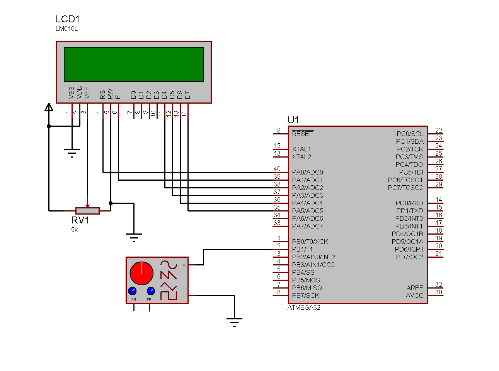

# AVR Frequency Meter

 

### This repository is Simple Digital Frequency Meter.
Frequency of a periodic signal is the number of cycles it repeats per second!. So If we count the number of cycles recorded in a second it will directly read the frequency.This circuit counts the input frequency in Hz and display it on the LCD. 

###### This repository contains Source Files & Proteus Circuit Simulation Files. 

---

 

